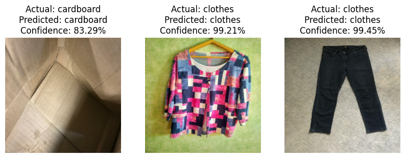

# Ekonify - A Waste Classification using Machine Learning and Deep Learning



Waste misclassification is a significant challenge in automated waste sorting, affecting recycling efficiency and environmental sustainability. This project explores **deep learning (CNN models) and classical machine learning (SVM)** to classify waste into **12 categories** using image datasets. The objective is to identify the best-performing model through various optimization techniques and hyperparameter tuning.

Dataset Source: [Kaggle - Garbage Classification (12 Classes)](https://www.kaggle.com/datasets/mostafaabla/garbage-classification)

## Discussion of Findings
Below is a summary of different training instances, their optimization techniques, and model performance.

- The **Baseline CNN (Model 1)** achieved the **highest accuracy (72.78%)**, demonstrating that even a simple CNN can outperform fine-tuned models when well-trained
- **Optimized Neural Network (Model 2)** came close with **68.91% accuracy**, benefiting from AdamW optimization, regularization (L2), and dropout
- Among the five instances, **Instance 3 (RMSprop + L2 + Dropout 0.3)** performed best with **68.67% accuracy** while the **SGD optimizer (Instance 5) performed the worst**, likely due to a very low learning rate (0.00005), which slowed convergence
- **SVM underperformed** compared to CNN models but still achieved **61.43% accuracy**, making it a viable alternative for simpler implementations

## Comparison: Classical ML (SVM) vs. Neural Networks
**Neural Networks outperformed SVM**, achieving higher accuracy (72.78% vs. 61.43%). Here's my comparison:

### Neural Networks (CNNs)
- Higher accuracy across all instances, with Model 1 reaching **72.78%**
- Able to learn complex patterns and extract meaningful features from images
- Requires substantial computing power and hyperparameter tuning

### Classical ML (SVM)
- Easier to train and faster than CNNs.
- Achieved **61.43% accuracy**, meaning it can still be useful for lightweight applications
- Despite the accuracy, it struggled with certain categories like **metal and plastic**, showing lower recall
- Lacks feature extraction capabilities compared to CNNs
- **SVM Hyperparameters:** `C=1.0, gamma='scale', kernel='rbf', decision function='OVR'`. Even with tuning, its performance plateaued compared to CNNs

In all, CNN models (especially the Baseline Model) were more effective, showing better generalization and recall across waste categories

## How to Run the Notebook
1. Clone the GitHub repository
2. Open `Summative_Intro_to_ml__[Eunice_Adewusi]_assignment.ipynb` in Jupyter Notebook or Google Colab
3. Install dependencies, if available in my repo, using:
   ```bash
   pip install -r requirements.txt
   ```
4. Run each cell in order to train and evaluate the models

## How to Load the Best Model
Navigate to the `saved_models/` directory and use:
   ```python
   from tensorflow.keras.models import load_model
   model = load_model('saved_models/baseline_cnn.keras')
   ```

## Downloading and Loading the SVM Model
The SVM model is stored in **Google Drive** due to its large size (~10GB). Instead of uploading the `.pkl` file to GitHub, a script is provided to download it

- Step 1: Run the script to download the SVM model
   ```sh
   python saved_models/download_svm_model_pkl.py
   ```
This script will automatically fetch the model and save it in the `saved_models` folder

- Step 2: Load the SVM model in Python
   ```python
   import pickle
   with open("saved_models/svm_model.pkl", "rb") as file:
      svm_model = pickle.load(file)
   ```

## Video Presentation
Here's a detailed 5-minute explanation covering model implementation, optimization techniques, and results. [Video Link Here](https://www.youtube.com/@climiradiroberts)
